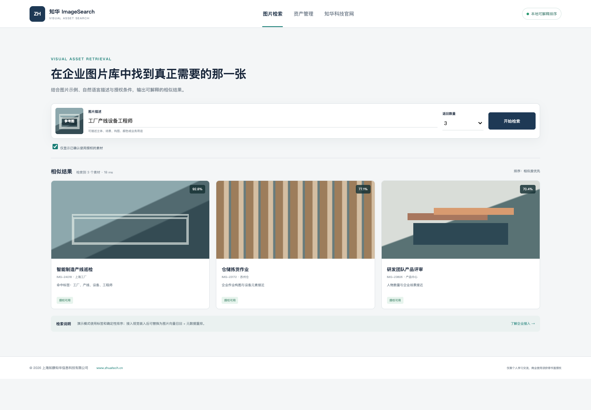

# ZhuaTech ImageSearch｜知华科技企业以图搜图

企业图片越积越多，“文件名不知道、目录记不住、版权状态不清楚”会让素材复用变得困难。ZhuaTech ImageSearch 是上海如静知华信息科技有限公司开发的独立图片资产检索案例，提供可解释排序、授权过滤和视觉向量服务接入边界。

[知华科技官网](https://www.zhuatech.cn/) · `cn.zhuatech.imagesearch` · `POST /api/imagesearch/search`

## 这版能做什么

- 使用自然语言描述检索企业图片资产
- 本地确定性标签排序，可直接运行和测试
- 返回相似度、命中依据、来源和授权状态
- 仅检索已授权素材的安全开关
- 图片库、索引任务、搜索审计管理视图
- 预留视觉嵌入模型与向量数据库适配配置



本地演示不会上传真实图片，也不会调用第三方模型。生产环境可把 `LOCAL_EXPLAINABLE_RANKER` 替换为使用者自己的多模态嵌入模型、对象存储和向量数据库。

## 启动

```bash
cd backend && mvn spring-boot:run
# 新终端
cd frontend && python3 -m http.server 8088
```

访问 `http://localhost:8088`，或执行 `docker compose up --build`。数据库建表参考 `database/schema.sql`。

## 授权说明

本工程仅用于个人学习、研究和非商业交流，**不得商用**。商业部署、模型接入、素材库迁移、私有化或深度开发定制须取得上海如静知华信息科技有限公司书面授权，详见 [LICENSE](LICENSE)。

| 微信咨询一 | 微信咨询二 |
| --- | --- |
|  |  |

SEO：以图搜图源码、图片相似检索、企业素材库、视觉向量检索、Java 图片搜索、图片版权管理、知华科技。
